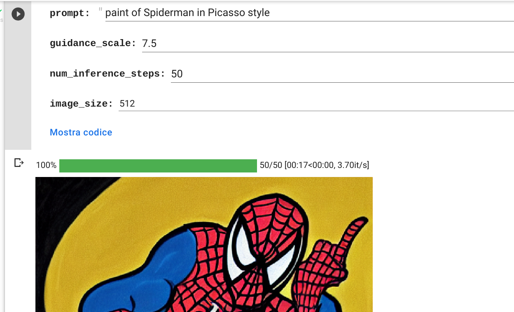

# Stable Diffusion on colab

The notepad is composed by two sections.

The first, named *Setup*, needs to be executed the first time you start th Colab session, and performs the installation of required librearies and the download of the model from **Huggingface**. In order to perform the second step, you need to register and account on **huggingface.com** to obtain an [API Token](https://huggingface.co/settings/tokens), that you must copy in the specific field.

The second section performs the image creation process: you need to understand that in this istance of *Stable Diffusion*, the *safety_checker* option is disabled, so the results can be also explicits.

